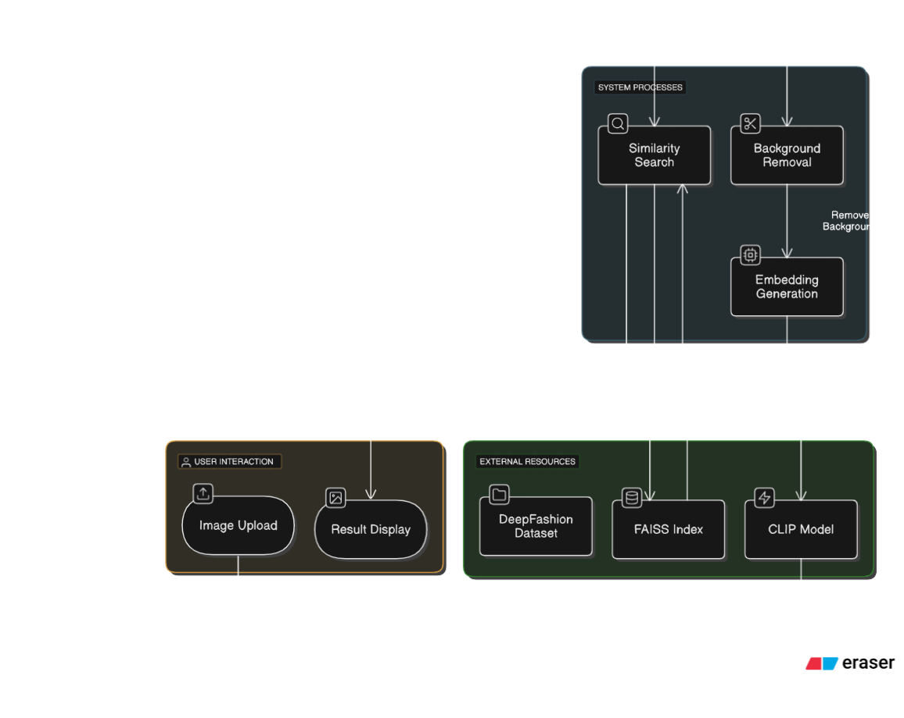

h1>Clothing Recommendation System</h1>

A <strong>Clothing Recommendation System</strong> for an e-commerce platform built using <strong>Node.js</strong>, <strong>MongoDB</strong>, <strong>React</strong>, <strong>Firebase</strong>, and a <strong>CLIP model</strong> for image-based product similarity search. This system suggests similar clothing items when a user uploads an image.

<h2>📊 System Overview</h2>

<ul>
    <li><strong>Image Upload:</strong> Users upload an image of a clothing item through the web interface.</li>
    <li><strong>Background Removal:</strong> The system processes the uploaded image and removes the background.</li>
    <li><strong>Embedding Generation:</strong> The CLIP model generates embeddings from the uploaded image.</li>
    <li><strong>Similarity Search:</strong> The generated embeddings are compared with a FAISS index built from the DeepFashion dataset.</li>
    <li><strong>Result Display:</strong> The top 5 most similar items are displayed to the user.</li>
</ul>

<h2>🛠️ Installation and Setup</h2>

<h3>Prerequisites:</h3>
<ul>
    <li>Node.js (v18+)</li>
    <li>Python (v3.10+)</li>
    <li>MongoDB</li>
</ul>

<h3>1. Clone the Repository</h3>
<pre><code>git clone https://github.com/yourusername/clothing-recommender.git

<h2>🚀 Usage</h2>

<ol>
    <li>Upload a clothing image through the web interface.</li>
    <li>The system processes the image and generates embeddings.</li>
    <li>Finds similar items using FAISS.</li>
    <li>Displays the top 5 most similar clothing items.</li>
</ol>

<h2>📊 Key Technologies</h2>

<ul>
    <li><strong>Frontend:</strong> React + TailwindCSS</li>
    <li><strong>Backend:</strong> Node.js (Express)</li>
    <li><strong>Database:</strong> MongoDB</li>
    <li><strong>Image Storage:</strong> Firebase</li>
    <li><strong>ML Model:</strong> CLIP (Python)</li>
    <li><strong>Similarity Search:</strong> FAISS</li>
</ul>

<h2>📷 System Flowchart</h2>

